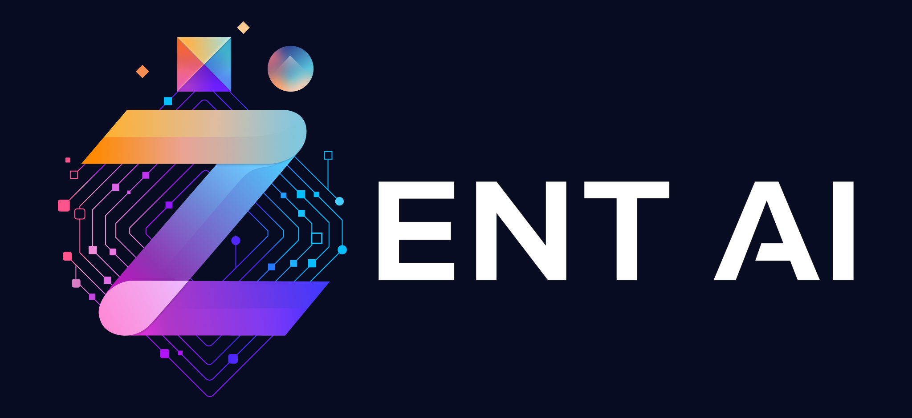
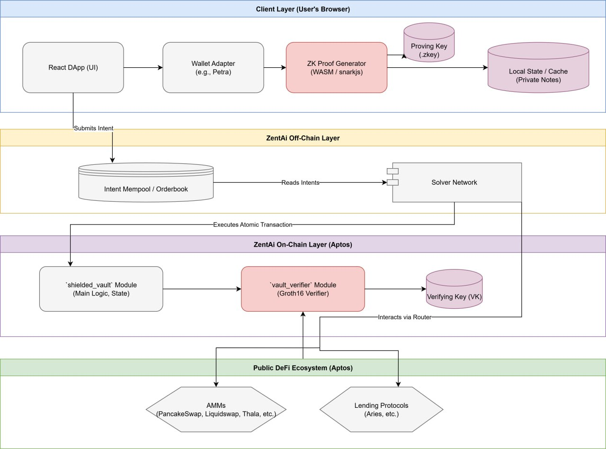

# Zent-AI: The Intent-Centric Privacy built on Aptos

ZentAI is a privacy-first DeFi protocol built on the Aptos blockchain that empowers users to execute complex financial operations without revealing sensitive on-chain data. By leveraging ZK-Groth16 zero-knowledge proofs, each transaction is shielded, ensuring complete confidentiality. An intuitive intent-centric interface lets users describe their desired outcome, and our off-chain AI Solver Network automatically constructs and submits the necessary atomic transactions.

## Problem

### Lack of Financial Privacy:
Every on-chain transaction is fully public, exposing wallet balances, spending patterns, and transaction history.

Malicious actors, data miners, or front-runners can trace funds from personal wallets into DeFi protocols, harvesting sensitive user data.

### Overly Complex Transactions:
Manually chaining swaps, loans, or yield strategies leads to mistakes, failed transactions, or extra fees.

There’s no easy way to bundle actions into one atomic step, so you risk slippage or sandwich attacks.

## Solution
ZentAi tackles both these big problems head-on by combining the coolest new technologies:

### Absolute Privacy with ZK-Groth16:
* Secret Deposits: When you put money into your ZentAi, you use a special 'secret code' just for that deposit. Our system then creates a 'crypto fingerprint' of your money and records only that on the blockchain. All the private details like the exact amount or who you are stay completely secret on your computer.
* Privacy Withdrawals: When you want to take money out, your computer automatically creates a 'magic proof' (a ZK-Groth16 proof). This proof is like a mathematical promise: "Yes, I have the right to take this money out," but it secure your original deposit, your current vault balance, or any past transactions.
* Secure On-Chain Check: Our smart contract on Aptos instantly checks this 'magic proof' to make sure everything's legit, all while keeping your private info hidden.
* Stop Double-Spending: Every withdrawal also uses a 'one-time code' (called a nullifier) to make sure you can't accidentally (or intentionally!) take out the same money twice.
### Super Easy Transactions with a Smart AI Network:
* You Just Say 'What You Want': Instead of manually doing complicated steps (like "withdraw APT, then swap to USDC, then send to a lending platform"), you simply tell ZentAi, "I want to withdraw 0.5 APT and receive USDC."
* AI Finds the Best Way: A smart 'Solver Network' (our AI!) listens to your requests. It uses AI to find the best and most efficient path to fulfill your request across all the different exchanges (like PancakeSwap, Liquidswap) or other DeFi projects on Aptos.
* 'All or Nothing' Trades: Once it figures out the best way, the system executes all the necessary steps as one single, bundled transaction. Either everything works perfectly, or nothing happens at all. This means you never get stuck with half-finished trades or lost money.


## Project Architecture



## 🛠️ Getting Started

```bash
# Clone the repository
git clone https://github.com/ZentAI-Aptos/ZentAI-FE
cd ZentAI-FE

# Install dependencies
npm install

# Set up environment variables
setup .env

# Run the application
npm start
